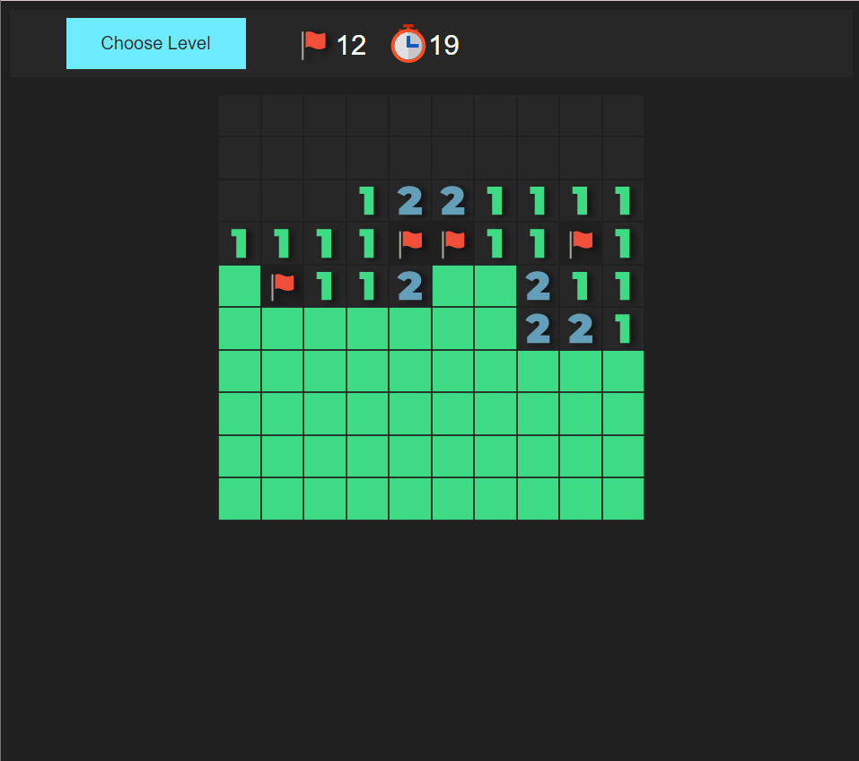

# Semester work, KAJ 2022
## Description
There is a simple browser Minesweeper game with standard traditional rules 
## Interface 
The top bar is divided on 3 parts.
1. Button "Choose Level" - you can choose game difficulty. Level difficulty influences size of the matrix: Easy 10x10, Medium 15x15, Hard 20x20
2. Flag icon - digit by the icon represents quantity of the flags remain
3. Timer icon - digit by the icon represent time passed since the first cell opened

**Game field**
- Press mouse left click to open unexplored cell
- Press mouse right click to mark cell by flag (or to remove flag from the cell)

**Rules**
- https://minesweepergame.com/strategy/how-to-play-minesweeper.php

